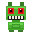

<div align="center">



# Jumping Robot game

[](https://github.com/michalswi/jumping-robot)
[](https://github.com/michalswi/jumping-robot/fork)
</div>

## stack

- **TypeScript** — language
- **Phaser 3** — game framework
- **Vite** — dev server & bundler

## howto

```bash
## Run
npm install
npm run dev

## Build
npm run build
```

Open `http://localhost:3000` in your browser.
